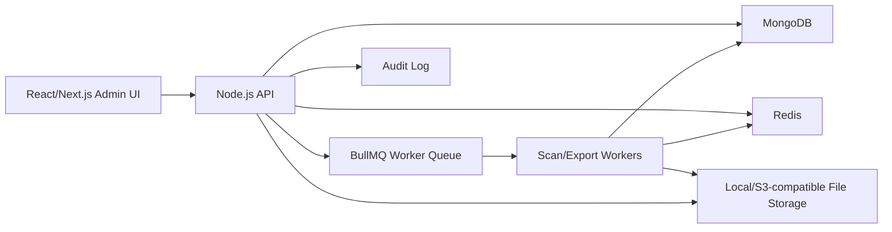
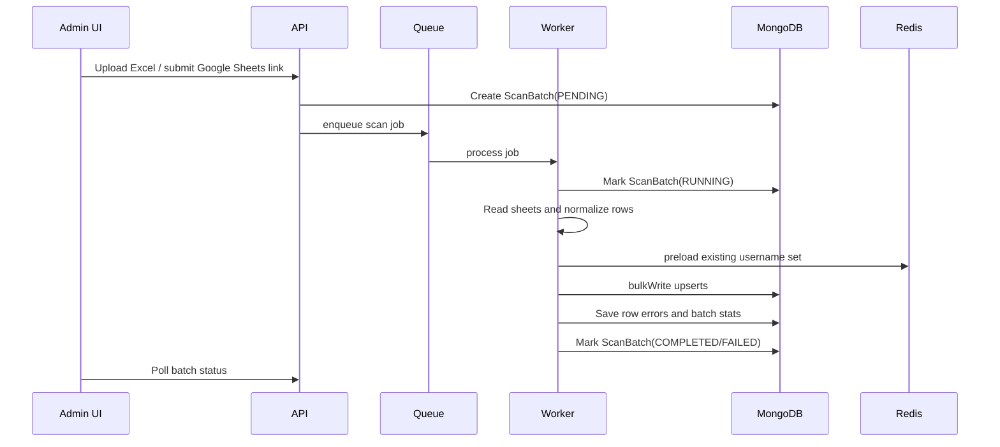

# ARMS - Account Resource Management System

## 1. Muc Tieu San Pham

ARMS la he thong quan ly kho tai khoan dang bang Excel/Google Sheets, chuyen toan bo du lieu sang database co kha nang truy vet, loc trung, danh dau trang thai tieu thu va export theo dinh dang phuc vu van hanh.

Pham vi su dung can tuan thu phap luat, dieu khoan dich vu cua nen tang va quyen so huu/hop le cua tung tai khoan. Khong luu secret dang plain text trong log, screenshot, docs, export khong can thiet, hoac kenh chat.

### Muc tieu chinh

- Import Excel/Google Sheets thanh inventory tap trung.
- Nhan dien cot linh hoat theo header va fallback theo format co dinh.
- Loc trung tuyet doi theo `username` da chuan hoa.
- Luu metadata truy vet: file, sheet/tab, nguoi quan ly, batch scan, thoi gian scan.
- Quan ly trang thai: `AVAILABLE`, `SOLD`, `USED`, `ERROR`, `BLACKLISTED`.
- Danh dau da ban/da dung bang blacklist paste list.
- Export file `.txt`, `.csv`, `.xlsx` theo template.
- Co audit log, thong ke batch scan, rollback logic co kiem soat.

## 2. Kien Truc Tong The



### Tech stack de xuat

- Frontend: Next.js + TypeScript + Tailwind/shadcn UI.
- Backend: NestJS hoac Express + TypeScript. Uu tien NestJS neu build prod lau dai.
- Database: MongoDB replica set.
- Cache/queue: Redis + BullMQ.
- Excel: ExcelJS streaming reader cho file vua/lon; Python Pandas chi dung nhu worker rieng khi file cuc lon va can xu ly batch nang.
- Auth: JWT access token + refresh token, RBAC.
- Storage: local trong dev, S3-compatible trong prod.
- Observability: pino logger, OpenTelemetry optional, health check, metrics endpoint.

## 3. Domain Model

### Account

Tai khoan la entity chinh. `username_normalized` la khoa duy nhat de loc trung.

```ts
type AccountStatus =
  | "AVAILABLE"
  | "SOLD"
  | "USED"
  | "ERROR"
  | "BLACKLISTED";
```

Thong tin nhay cam nhu password, cookie, token, email_password phai duoc ma hoa o application layer truoc khi ghi DB.

### ScanBatch

Moi lan import file/link tao mot batch de thong ke:

- Tong row doc duoc.
- So row hop le.
- So account moi.
- So account trung.
- So row loi.
- Sheet/tab nao co bao nhieu account.
- File/link nguon.
- Ai thuc hien.

### AccountHistory

Luu audit moi thay doi quan trong:

- `CREATED_FROM_SCAN`
- `UPDATED_FROM_SCAN`
- `MARKED_SOLD`
- `MARKED_USED`
- `MARKED_ERROR`
- `BLACKLISTED`
- `EXPORTED`
- `RESTORED`

### ExportJob

Quan ly export file lon, trang thai job va template duoc chon.

## 4. MongoDB Schema De Xuat

```ts
const AccountSchema = new Schema(
  {
    username: { type: String, required: true },
    username_normalized: { type: String, required: true, unique: true },

    password_enc: { type: String },
    cookie_enc: { type: String },
    token_enc: { type: String },
    email: { type: String },
    email_password_enc: { type: String },

    raw: {
      values: { type: Map, of: Schema.Types.Mixed },
      row_number: Number,
      row_hash: String
    },

    metadata: {
      source_file: String,
      source_url: String,
      source_sheet: String,
      source_tab_label: String,
      managed_by: String,
      batch_id: { type: Schema.Types.ObjectId, ref: "ScanBatch" },
      first_scan_at: Date,
      last_scan_at: Date
    },

    status: {
      type: String,
      enum: ["AVAILABLE", "SOLD", "USED", "ERROR", "BLACKLISTED"],
      default: "AVAILABLE",
      index: true
    },

    consumption: {
      sold_to: String,
      sold_at: Date,
      order_id: String,
      note: String
    },

    quality: {
      has_cookie: Boolean,
      has_token: Boolean,
      has_email: Boolean,
      parse_errors: [String],
      last_check_at: Date,
      last_check_result: String
    },

    tags: [String],
    history: [
      {
        action: String,
        actor_id: String,
        timestamp: { type: Date, default: Date.now },
        note: String,
        batch_id: Schema.Types.ObjectId,
        diff: Schema.Types.Mixed
      }
    ]
  },
  { timestamps: true }
);

AccountSchema.index({ username_normalized: 1 }, { unique: true });
AccountSchema.index({ status: 1, "metadata.last_scan_at": -1 });
AccountSchema.index({ "metadata.source_sheet": 1, status: 1 });
AccountSchema.index({ "metadata.batch_id": 1 });
AccountSchema.index({ email: 1 }, { sparse: true });
```

## 5. Dinh Dang Du Lieu Dau Vao

Du lieu mau dang tab-separated co the map nhu sau:

```text
account_id_or_username    display_name_or_password    cookie    email    email_password    cookie_duplicate
```

Khong nen gia dinh cot A luon la username neu file co header. Thu tu uu tien:

1. Neu co header: map theo alias.
2. Neu khong co header: dung profile parser theo format.
3. Neu row khong du thong tin toi thieu: dua vao error report.

### Header aliases

```ts
const HEADER_ALIASES = {
  username: ["username", "user", "account", "account_id", "tai khoan", "tk"],
  password: ["password", "pass", "mat khau", "mk"],
  cookie: ["cookie", "cookies", "spc_f", "shopee_cookie"],
  token: ["token", "access_token"],
  email: ["email", "mail"],
  email_password: ["email_password", "mail_pass", "pass mail", "mat khau mail"]
};
```

### Chuan hoa username

- Trim space.
- Lowercase neu username cua nguon khong phan biet hoa thuong.
- Loai bo ky tu control, tab, newline.
- Reject rong/null.
- Khong log full cookie/token/password khi row loi.

## 6. Smart Scan Engine

### Workflow



### Duplicate strategy

Nguon chinh xac la unique index MongoDB tren `username_normalized`. Redis chi dung de tang toc dem trung va preview.

- Redis key: `arms:account:usernames:v1`
- Khi scan: preload username tu Redis set neu co.
- Khi upsert thanh cong account moi: add vao Redis.
- Neu Redis miss hoac mat cache: MongoDB unique index van dam bao khong trung.

### Upsert policy

Khi username da ton tai:

- Cap nhat `metadata.last_scan_at`.
- Cap nhat `metadata.source_file`, `source_sheet`, `batch_id` neu can truy vet lan scan moi nhat.
- Co option `overwriteSecrets`: mac dinh `false` de tranh ghi de secret tot bang data cu loi.
- Them history `UPDATED_FROM_SCAN`.

Khi username moi:

- Tao account voi status `AVAILABLE`.
- Set `first_scan_at` va `last_scan_at`.
- Them history `CREATED_FROM_SCAN`.

### Bulk write pattern

Khong goi `await` ben trong `worksheet.eachRow` truc tiep. Gom batch 500-2000 rows roi `bulkWrite`.

```ts
await AccountModel.bulkWrite(
  operations,
  { ordered: false }
);
```

## 7. Google Sheets Import

Ho tro 2 che do:

- Public/export link: tai file xlsx/csv tam thoi roi xu ly nhu Excel.
- Service Account: dung Google Sheets API de doc sheet metadata va values.

Luu y:

- Luu `source_url`, spreadsheet id, sheet id.
- Rate limit import theo user.
- Khong luu credential Google trong code; dung env/secret manager.

## 8. Exclusion, Sold Marking Va Blacklist

### Input

Admin dan list username, moi dong mot account. He thong normalize va dedupe input truoc khi update.

### API

```http
POST /api/accounts/mark-sold
POST /api/accounts/mark-used
POST /api/accounts/blacklist
```

### Logic

```ts
const result = await AccountModel.updateMany(
  { username_normalized: { $in: normalizedList } },
  {
    $set: {
      status: "SOLD",
      "consumption.sold_at": new Date(),
      "consumption.sold_to": payload.sold_to,
      "consumption.order_id": payload.order_id
    },
    $push: {
      history: {
        action: "MARKED_SOLD",
        actor_id: actor.id,
        timestamp: new Date(),
        note: payload.note
      }
    }
  }
);
```

Ket qua tra ve:

- Input count.
- Unique normalized count.
- Matched count.
- Modified count.
- Not found list.
- Already sold/used count.

## 9. Inventory Dashboard

### Man hinh can co

- Overview: tong account theo status, theo source, theo ngay scan.
- Scan batches: lich su import, ket qua tung sheet/tab.
- Accounts table: filter, search, bulk action.
- Mark sold/used: paste list, preview, confirm.
- Export center: tao export job, tai file, lich su export.
- Error report: row loi, ly do loi, file/sheet/row.
- Settings: parser profile, header aliases, export templates, RBAC.

### Filter

- Status.
- Source file.
- Sheet/tab.
- Managed by.
- Scan date range.
- Has cookie/token/email.
- Tags.
- Batch id.

## 10. Export Templates

Export phai co template ro rang de tranh lo secret qua nham dinh dang.

### Template examples

```text
username|password|cookie
username<TAB>password<TAB>cookie<TAB>email<TAB>email_password
username,password,cookie
```

### Export rules

- Chi export mac dinh status `AVAILABLE`.
- Sau export co option tu dong mark `USED` hoac giu nguyen.
- Log history `EXPORTED` cho account duoc export.
- Gioi han so dong/export theo role.
- File export co thoi gian het han neu luu tren object storage.

## 11. API Design

### Scan

```http
POST /api/scan/upload
GET  /api/scan/batches
GET  /api/scan/batches/:id
GET  /api/scan/batches/:id/errors
POST /api/scan/google-sheets
```

### Accounts

```http
GET    /api/accounts
GET    /api/accounts/:id
PATCH  /api/accounts/:id/status
POST   /api/accounts/mark-sold
POST   /api/accounts/mark-used
POST   /api/accounts/blacklist
POST   /api/accounts/bulk-tag
```

### Export

```http
POST /api/exports
GET  /api/exports
GET  /api/exports/:id
GET  /api/exports/:id/download
```

### Admin

```http
GET  /api/stats/overview
GET  /api/settings/parser-profiles
PUT  /api/settings/parser-profiles/:id
GET  /api/audit-logs
```

## 12. Security Va Compliance

### Bat buoc cho production

- Ma hoa password/cookie/token/email password bang AES-256-GCM hoac libsodium.
- Encryption key nam trong env/secret manager, khong commit.
- Role-based access control:
  - `OWNER`: full access.
  - `MANAGER`: scan/export/mark status.
  - `VIEWER`: xem thong ke, khong xem secret.
  - `AUDITOR`: xem audit, khong export secret.
- Audit log moi hanh dong bulk.
- Mask secret tren UI: chi hien nut copy neu role duoc phep.
- Rate limit API upload/export.
- Validate file type va size.
- Antivirus scan neu cho upload tu nhieu user.
- Backup MongoDB hang ngay.
- Restore drill moi thang.

### Log policy

Khong log:

- Cookie full.
- Token full.
- Password.
- Email password.
- File export secret.

Chi log:

- Username masked neu can.
- Batch id.
- Counts.
- Error code.

## 13. Error Handling

### Row-level errors

- `MISSING_USERNAME`
- `INVALID_USERNAME`
- `DUPLICATED_IN_SAME_FILE`
- `EMPTY_ROW`
- `UNSUPPORTED_CELL_TYPE`
- `SECRET_ENCRYPTION_FAILED`

### Job-level errors

- `FILE_TOO_LARGE`
- `INVALID_FILE_FORMAT`
- `SHEET_API_AUTH_FAILED`
- `MONGODB_BULK_WRITE_FAILED`
- `REDIS_UNAVAILABLE`

Neu Redis loi, scan van tiep tuc dua vao MongoDB unique index, chi mat preview duplicate nhanh.

## 14. Testing Strategy

### Unit tests

- Normalize username.
- Header mapper.
- Row parser.
- Secret encryption/decryption.
- Export formatter.
- Status transition rules.

### Integration tests

- Upload xlsx nhieu sheet.
- Scan duplicate trong cung file.
- Scan duplicate da co trong DB.
- Mark sold voi found/not found.
- Export only AVAILABLE.
- Redis unavailable fallback.

### E2E tests

- Admin upload file -> xem batch complete -> filter account -> export.
- Paste blacklist -> preview -> confirm -> status update.

## 15. Deployment

### Docker services

- `api`: Node.js/NestJS API.
- `worker`: BullMQ scan/export worker.
- `web`: Next.js frontend.
- `mongo`: MongoDB.
- `redis`: Redis.

### Env required

```env
NODE_ENV=production
MONGODB_URI=mongodb://...
REDIS_URL=redis://...
JWT_SECRET=...
ENCRYPTION_KEY_BASE64=...
STORAGE_DRIVER=local
UPLOAD_MAX_MB=100
EXPORT_MAX_ROWS=50000
```

### Health checks

```http
GET /health
GET /health/mongo
GET /health/redis
```

## 16. Folder Structure De Xuat

```text
apps/
  api/
    src/
      modules/
        accounts/
        scan/
        exports/
        audit/
        auth/
        settings/
      common/
        crypto/
        database/
        queue/
        logger/
  web/
    src/
      app/
      components/
      features/
      lib/
  worker/
    src/
      jobs/
      parsers/
      exporters/
packages/
  shared/
    src/
      types/
      validation/
docs/
  ARMS_ARCHITECTURE.md
```

## 17. Implementation Roadmap

### Phase 1 - Foundation

- Tao monorepo.
- Setup TypeScript, lint, format.
- Setup MongoDB/Redis docker compose.
- Tao Account, ScanBatch, ExportJob schemas.
- Tao crypto service ma hoa secret.
- Tao auth basic + RBAC.

### Phase 2 - Smart Scan MVP

- Upload xlsx.
- ExcelJS streaming parser.
- Header mapper + fixed profile parser.
- Normalize username.
- Bulk upsert.
- Batch stats.
- Row error report.
- Duplicate report theo sheet/tab.

### Phase 3 - Inventory Dashboard

- Accounts table.
- Filter theo status/source/sheet/date.
- Batch history.
- Account detail drawer.
- Secret masking/copy theo role.

### Phase 4 - Sold/Used/Blacklist

- Paste list parser.
- Preview matched/not found.
- Confirm bulk update.
- Audit log.
- Status transition validation.

### Phase 5 - Export Center

- Export templates.
- Export job queue.
- Download file.
- Optional mark exported accounts as USED.
- Export history.

### Phase 6 - Production Hardening

- Google Sheets import.
- Redis username set warmup.
- Metrics and structured logging.
- Backup/restore docs.
- E2E tests.
- Docker deployment.

## 18. Task List Cho Vibe Code

Dung danh sach nay de giao task lan luot cho coding agent.

### Backend tasks

1. Scaffold NestJS API voi modules `auth`, `accounts`, `scan`, `exports`, `audit`, `settings`.
2. Tao Mongo schemas: `Account`, `ScanBatch`, `ExportJob`, `AuditLog`.
3. Implement `CryptoService` dung AES-256-GCM, co test.
4. Implement `UsernameNormalizer` va `HeaderMapper`, co test alias tieng Viet/Anh.
5. Implement upload endpoint `POST /api/scan/upload`.
6. Implement BullMQ scan worker doc ExcelJS streaming va bulkWrite.
7. Implement batch status endpoints va row error endpoint.
8. Implement `GET /api/accounts` voi pagination/filter/sort.
9. Implement bulk mark sold/used/blacklist voi preview va confirm.
10. Implement export templates va export worker.
11. Implement audit log middleware/service.
12. Implement RBAC guard.

### Frontend tasks

1. Scaffold Next.js admin app.
2. Tao layout: sidebar, topbar, auth shell.
3. Tao dashboard overview cards/charts.
4. Tao scan upload page voi progress/polling.
5. Tao batch detail page hien stats theo sheet/tab va errors.
6. Tao accounts table voi filter drawer.
7. Tao mark sold/used page voi paste list, preview, confirm.
8. Tao export center voi template picker va download history.
9. Tao settings page cho parser profiles/header aliases.
10. Tao role-based secret masking UI.

### DevOps tasks

1. Tao `docker-compose.yml` cho mongo, redis, api, worker, web.
2. Tao `.env.example`.
3. Tao seed script tao admin user.
4. Tao backup script MongoDB.
5. Tao CI chay lint/test/build.

## 19. Acceptance Criteria

He thong duoc coi la dat MVP khi:

- Import duoc file xlsx nhieu sheet.
- Bao cao dung tong row, new, duplicate, error.
- Username duplicate khong the tao 2 account trong DB.
- Paste list sold cap nhat dung status va tra ve not found.
- Dashboard filter duoc theo status/source/sheet/date.
- Export duoc file theo template va chi lay account dung dieu kien.
- Secret khong xuat hien trong log.
- Co test cho parser, duplicate, mark sold, export.

## 20. Ghi Chu Ve Du Lieu Mau

Du lieu dang:

```text
<username> <display/password> <cookie> <email> <email_password> <cookie_repeat>
```

Vi co cookie va password, chi nen dung file local/private de test. Khi tao fixture test, thay cookie/token/password bang gia tri gia lap nhu:

```text
user001 Pass001 .shopee.vn=SPC_F=REDACTED user001@example.test MailPass001 .shopee.vn=SPC_F=REDACTED
```

