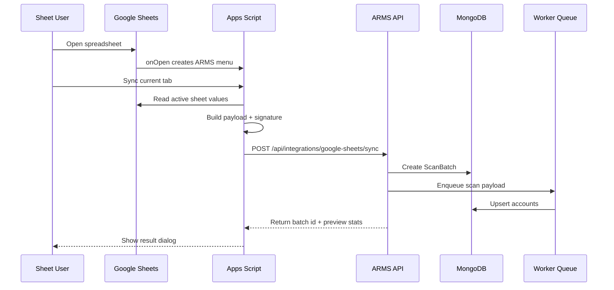

# ARMS - Google Apps Script Integration

## 1. Muc Tieu

Tai lieu nay mo ta cach tich hop Google Sheets voi ARMS bang Google Apps Script de dong bo du lieu tai khoan tu tung tab Sheet ve he thong trung tam.

Huong tich hop de xuat:

- Google Sheets la noi nguoi quan ly nhap/nhan danh sach tai khoan.
- Apps Script tao menu `ARMS` ngay trong Google Sheet.
- Nguoi dung bam `Sync current tab` hoac `Sync all tabs`.
- Apps Script doc du lieu trong tab, dong goi metadata, gui ve ARMS API.
- ARMS tao `ScanBatch`, map cot, normalize username, loc trung va luu MongoDB.

Khong nen luu password, cookie, token trong log Apps Script, Execution transcript, response hien thi hoac email thong bao.

## 2. Kien Truc Luong Du Lieu



## 3. Che Do Dong Bo

### 3.1 Sync current tab

Dung khi moi tab la mot nguon rieng, vi du:

- `3/3-3250`
- `05/03-1652`
- `06/03-1873`
- `14/3-2579`

Apps Script chi doc tab dang mo, gui kem `sheetName` de ARMS gan metadata `source_sheet`.

### 3.2 Sync all tabs

Dung khi can nap lai toan bo file Sheet.

Nen bo qua cac tab cau hinh:

- `README`
- `CONFIG`
- `SUMMARY`
- `REPORT`
- tab bat dau bang `_`

### 3.3 Sync selected range

Optional. Dung khi chi muon dong bo mot khoang du lieu dang chon.

## 4. API Contract

### Endpoint

```http
POST /api/integrations/google-sheets/sync
Content-Type: application/json
X-ARMS-Client: google-apps-script
X-ARMS-Timestamp: 2026-07-02T15:00:00.000Z
X-ARMS-Signature: sha256=<hmac_hex>
```

### Request body

```json
{
  "spreadsheetId": "1abc...",
  "spreadsheetName": "Shopp co don 73",
  "spreadsheetUrl": "https://docs.google.com/spreadsheets/d/...",
  "syncMode": "CURRENT_TAB",
  "actor": {
    "email": "manager@example.com",
    "name": "Manager Name"
  },
  "tabs": [
    {
      "sheetId": 123456,
      "sheetName": "3/3-3250",
      "managedBy": "Manager Name",
      "rangeA1": "A1:F2000",
      "hasHeader": false,
      "rows": [
        ["user001", "Pass001", ".shopee.vn=SPC_F=REDACTED", "user001@example.test", "MailPass001", ".shopee.vn=SPC_F=REDACTED"]
      ]
    }
  ],
  "clientMeta": {
    "scriptVersion": "1.0.0",
    "timezone": "Asia/Bangkok",
    "sentAt": "2026-07-02T15:00:00.000Z"
  }
}
```

### Response body

```json
{
  "ok": true,
  "batchId": "66a000000000000000000001",
  "status": "QUEUED",
  "summary": {
    "receivedTabs": 1,
    "receivedRows": 2000,
    "acceptedRows": 1980,
    "rejectedRows": 20
  },
  "message": "Scan batch queued"
}
```

### Error response

```json
{
  "ok": false,
  "code": "INVALID_SIGNATURE",
  "message": "Request signature is invalid"
}
```

## 5. Bao Mat

### 5.1 Khuyen nghi production: HMAC signature

Apps Script va ARMS cung giu mot shared secret.

Chuoi ky:

```text
timestamp + "." + requestBodyJson
```

Header:

```text
X-ARMS-Signature: sha256=<hex_hmac_sha256>
```

Backend verify:

- Timestamp khong qua 5 phut.
- HMAC khop.
- Chua dung nonce neu co co che replay protection.

### 5.2 Don gian hon: API key

Dung cho MVP noi bo:

```http
X-ARMS-API-Key: <secret>
```

Nhung production nen chuyen sang HMAC vi API key thuong bi copy de lo hon.

### 5.3 Apps Script Properties

Luu config trong `Script Properties`, khong hard-code trong source neu co the.

Keys:

- `ARMS_API_BASE_URL`
- `ARMS_API_KEY`
- `ARMS_HMAC_SECRET`
- `ARMS_MANAGED_BY`

## 6. Apps Script Code Mau

Tao file `Code.gs` trong Apps Script gan voi Google Sheet.

```javascript
const ARMS_SCRIPT_VERSION = '1.0.0';

function onOpen() {
  SpreadsheetApp.getUi()
    .createMenu('ARMS')
    .addItem('Sync current tab', 'syncCurrentTab')
    .addItem('Sync all tabs', 'syncAllTabs')
    .addSeparator()
    .addItem('Configure ARMS', 'showConfigHelp')
    .addToUi();
}

function syncCurrentTab() {
  const spreadsheet = SpreadsheetApp.getActiveSpreadsheet();
  const sheet = spreadsheet.getActiveSheet();
  const payload = buildPayload_(spreadsheet, [sheet], 'CURRENT_TAB');
  const result = sendToArms_(payload);
  showResult_(result);
}

function syncAllTabs() {
  const spreadsheet = SpreadsheetApp.getActiveSpreadsheet();
  const sheets = spreadsheet.getSheets().filter(function(sheet) {
    return shouldSyncSheet_(sheet.getName());
  });
  const payload = buildPayload_(spreadsheet, sheets, 'ALL_TABS');
  const result = sendToArms_(payload);
  showResult_(result);
}

function buildPayload_(spreadsheet, sheets, syncMode) {
  const props = PropertiesService.getScriptProperties();
  const managedBy = props.getProperty('ARMS_MANAGED_BY') || '';
  const actorEmail = Session.getActiveUser().getEmail() || '';

  return {
    spreadsheetId: spreadsheet.getId(),
    spreadsheetName: spreadsheet.getName(),
    spreadsheetUrl: spreadsheet.getUrl(),
    syncMode: syncMode,
    actor: {
      email: actorEmail,
      name: managedBy
    },
    tabs: sheets.map(function(sheet) {
      return readSheet_(sheet, managedBy);
    }),
    clientMeta: {
      scriptVersion: ARMS_SCRIPT_VERSION,
      timezone: Session.getScriptTimeZone(),
      sentAt: new Date().toISOString()
    }
  };
}

function readSheet_(sheet, managedBy) {
  const range = sheet.getDataRange();
  const values = range.getValues();
  const cleanedRows = values
    .map(function(row) {
      return row.map(function(cell) {
        return normalizeCell_(cell);
      });
    })
    .filter(function(row) {
      return row.some(function(cell) {
        return cell !== '';
      });
    });

  return {
    sheetId: sheet.getSheetId(),
    sheetName: sheet.getName(),
    managedBy: managedBy,
    rangeA1: range.getA1Notation(),
    hasHeader: detectHeader_(cleanedRows),
    rows: cleanedRows
  };
}

function normalizeCell_(cell) {
  if (cell === null || cell === undefined) return '';
  if (cell instanceof Date) return cell.toISOString();
  return String(cell).trim();
}

function detectHeader_(rows) {
  if (!rows.length) return false;
  const firstRow = rows[0].join(' ').toLowerCase();
  const markers = ['username', 'user', 'account', 'tai khoan', 'password', 'cookie', 'email'];
  return markers.some(function(marker) {
    return firstRow.indexOf(marker) !== -1;
  });
}

function shouldSyncSheet_(sheetName) {
  const normalized = String(sheetName).trim().toUpperCase();
  if (!normalized) return false;
  if (normalized.charAt(0) === '_') return false;
  return ['README', 'CONFIG', 'SUMMARY', 'REPORT'].indexOf(normalized) === -1;
}

function sendToArms_(payload) {
  const props = PropertiesService.getScriptProperties();
  const baseUrl = props.getProperty('ARMS_API_BASE_URL');
  const apiKey = props.getProperty('ARMS_API_KEY');
  const hmacSecret = props.getProperty('ARMS_HMAC_SECRET');

  if (!baseUrl) {
    throw new Error('Missing ARMS_API_BASE_URL in Script Properties');
  }

  const url = baseUrl.replace(/\/$/, '') + '/api/integrations/google-sheets/sync';
  const body = JSON.stringify(payload);
  const timestamp = new Date().toISOString();
  const headers = {
    'Content-Type': 'application/json',
    'X-ARMS-Client': 'google-apps-script',
    'X-ARMS-Timestamp': timestamp
  };

  if (hmacSecret) {
    headers['X-ARMS-Signature'] = buildHmacSignature_(timestamp, body, hmacSecret);
  } else if (apiKey) {
    headers['X-ARMS-API-Key'] = apiKey;
  } else {
    throw new Error('Missing ARMS_HMAC_SECRET or ARMS_API_KEY in Script Properties');
  }

  const response = UrlFetchApp.fetch(url, {
    method: 'post',
    contentType: 'application/json',
    headers: headers,
    payload: body,
    muteHttpExceptions: true
  });

  const text = response.getContentText();
  const statusCode = response.getResponseCode();
  let json;

  try {
    json = JSON.parse(text);
  } catch (error) {
    json = {
      ok: false,
      code: 'INVALID_JSON_RESPONSE',
      message: text
    };
  }

  if (statusCode < 200 || statusCode >= 300) {
    json.ok = false;
    json.httpStatus = statusCode;
  }

  return json;
}

function buildHmacSignature_(timestamp, body, secret) {
  const message = timestamp + '.' + body;
  const bytes = Utilities.computeHmacSha256Signature(message, secret);
  const hex = bytes.map(function(byte) {
    const value = byte < 0 ? byte + 256 : byte;
    return ('0' + value.toString(16)).slice(-2);
  }).join('');
  return 'sha256=' + hex;
}

function showResult_(result) {
  const ui = SpreadsheetApp.getUi();
  if (result.ok) {
    const summary = result.summary || {};
    ui.alert(
      'ARMS sync queued',
      'Batch: ' + result.batchId + '\n' +
        'Tabs: ' + (summary.receivedTabs || 0) + '\n' +
        'Rows: ' + (summary.receivedRows || 0) + '\n' +
        'Status: ' + result.status,
      ui.ButtonSet.OK
    );
    return;
  }

  ui.alert(
    'ARMS sync failed',
    'Code: ' + (result.code || result.httpStatus || 'UNKNOWN') + '\n' +
      'Message: ' + (result.message || 'Unknown error'),
    ui.ButtonSet.OK
  );
}

function showConfigHelp() {
  SpreadsheetApp.getUi().alert(
    'ARMS configuration',
    'Open Apps Script > Project Settings > Script Properties and set:\n\n' +
      'ARMS_API_BASE_URL\n' +
      'ARMS_HMAC_SECRET or ARMS_API_KEY\n' +
      'ARMS_MANAGED_BY',
    SpreadsheetApp.getUi().ButtonSet.OK
  );
}
```

## 7. Backend Endpoint Design

### Controller behavior

1. Verify HMAC/API key.
2. Validate payload size.
3. Validate required fields: spreadsheet id, tabs, rows.
4. Create `ScanBatch` with source type `GOOGLE_SHEETS`.
5. Push job to queue.
6. Return queued result fast, khong xu ly toan bo trong request neu rows lon.

### DTO TypeScript

```ts
export type GoogleSheetsSyncMode = "CURRENT_TAB" | "ALL_TABS" | "SELECTED_RANGE";

export interface GoogleSheetsSyncRequest {
  spreadsheetId: string;
  spreadsheetName: string;
  spreadsheetUrl?: string;
  syncMode: GoogleSheetsSyncMode;
  actor?: {
    email?: string;
    name?: string;
  };
  tabs: Array<{
    sheetId: number;
    sheetName: string;
    managedBy?: string;
    rangeA1?: string;
    hasHeader: boolean;
    rows: string[][];
  }>;
  clientMeta?: {
    scriptVersion?: string;
    timezone?: string;
    sentAt?: string;
  };
}
```

### ScanBatch metadata

```ts
{
  source_type: "GOOGLE_SHEETS",
  source_file: null,
  source_url: payload.spreadsheetUrl,
  spreadsheet_id: payload.spreadsheetId,
  spreadsheet_name: payload.spreadsheetName,
  sync_mode: payload.syncMode,
  actor_email: payload.actor?.email,
  client_meta: payload.clientMeta
}
```

## 8. Parser Cho Format Khong Header

Voi row dang:

```text
username    password_or_display    cookie    email    email_password    cookie_repeat
```

Mapping fallback:

```ts
const FIXED_SHOPEE_PROFILE = {
  username: 0,
  password: 1,
  cookie: 2,
  email: 3,
  email_password: 4,
  cookie_repeat: 5
};
```

Neu `cookie` rong nhung `cookie_repeat` co gia tri, co the lay `cookie_repeat`.

Neu `password_or_display` thuc te la display name, tao setting parser profile:

```json
{
  "profileName": "shopee_6_col",
  "columns": {
    "username": 0,
    "display_name": 1,
    "cookie": 2,
    "email": 3,
    "email_password": 4,
    "cookie_repeat": 5
  }
}
```

## 9. Gioi Han Va Hieu Nang

Apps Script co gioi han thoi gian chay va payload. De an toan:

- Moi request khong nen gui qua 10,000 rows.
- Neu tab lon, chia chunk 1,000-2,000 rows/request.
- Backend nen ho tro `syncSessionId` va `chunkIndex` neu can chunking.
- Voi kho rat lon, uu tien backend doc bang Google Sheets API thay vi Apps Script gui toan bo data.

## 10. Chunking Optional

Neu can dong bo tab lon:

```json
{
  "syncSessionId": "uuid",
  "chunkIndex": 0,
  "chunkTotal": 5,
  "isFinalChunk": false
}
```

Backend gom chunks vao storage tam thoi, khi nhan `isFinalChunk=true` thi enqueue scan.

MVP co the bo qua chunking neu moi tab chi vai nghin dong.

## 11. UI Tren ARMS

Nen co man hinh `Integrations > Google Sheets`:

- Tao API key/HMAC secret.
- Copy Apps Script template.
- Xem danh sach spreadsheet da sync.
- Xem batch theo spreadsheet/tab.
- Vo hieu hoa key bi lo.
- Cau hinh parser profile mac dinh cho Google Sheets.

## 12. Checklist Trien Khai

### Apps Script

- [ ] Tao Apps Script gan voi spreadsheet.
- [ ] Them `onOpen` menu `ARMS`.
- [ ] Them `syncCurrentTab`.
- [ ] Them `syncAllTabs`.
- [ ] Doc Script Properties.
- [ ] Ky request bang HMAC.
- [ ] Khong log secret/data nhay cam.
- [ ] Hien ket qua batch id sau khi sync.

### Backend

- [ ] Tao endpoint `/api/integrations/google-sheets/sync`.
- [ ] Verify HMAC/API key.
- [ ] Validate payload bang Zod/class-validator.
- [ ] Tao ScanBatch source type `GOOGLE_SHEETS`.
- [ ] Enqueue scan job.
- [ ] Parser xu ly `tabs[].rows`.
- [ ] Gan metadata `spreadsheetName`, `sheetName`, `managedBy`.
- [ ] Bulk upsert theo `username_normalized`.
- [ ] Tra ve stats va errors.

### Security

- [ ] Rotate API key/HMAC secret.
- [ ] Timestamp replay window 5 phut.
- [ ] Rate limit theo integration key.
- [ ] Mask secrets trong logs.
- [ ] Audit log moi request sync.

## 13. Prompt Mau Cho Vibe Code

```text
Doc docs/ARMS_ARCHITECTURE.md va docs/GOOGLE_APPS_SCRIPT_INTEGRATION.md.
Hay implement backend endpoint Google Apps Script sync cho ARMS:
- POST /api/integrations/google-sheets/sync
- verify HMAC signature hoac API key
- validate payload
- tao ScanBatch source_type GOOGLE_SHEETS
- enqueue worker scan rows
- parser ho tro hasHeader va fallback shopee_6_col
- bulk upsert Account theo username_normalized
- khong log password/cookie/token/email_password
- viet unit/integration tests cho signature, parser, duplicate handling.
```

```text
Doc docs/GOOGLE_APPS_SCRIPT_INTEGRATION.md.
Hay tao file apps-script/Code.gs chua Apps Script template:
- menu ARMS
- Sync current tab
- Sync all tabs
- Script Properties config
- HMAC signature
- result dialog
- khong log secret.
```

