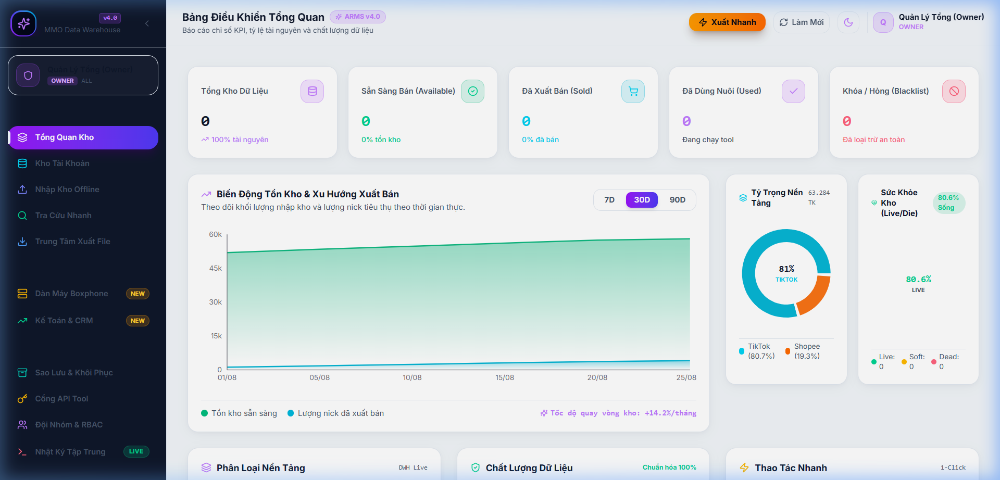
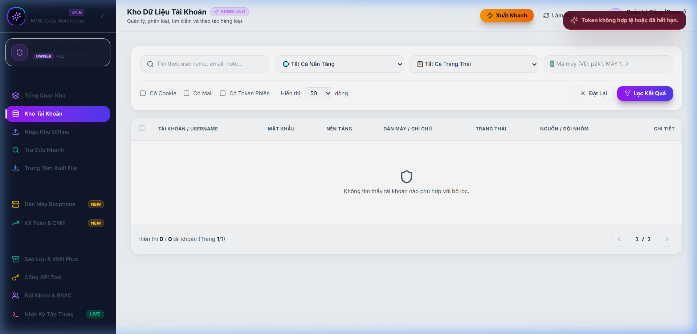
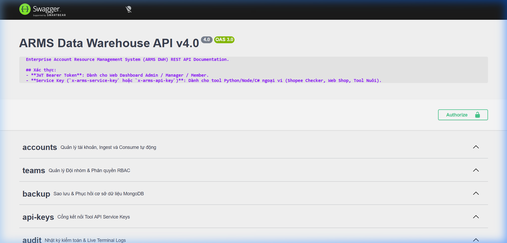

#  HƯỚNG DẪN VẬN HÀNH HỆ THỐNG ARMS DWH v4.0

Tài liệu hướng dẫn sử dụng và kiểm thử trực quan hệ thống **ARMS Data Warehouse Enterprise v4.0**.

---

## 1. Bảng Điều Khiển Tổng Quan (Dashboard Overview & BI Charts)



- **Các thẻ KPI**: Theo dõi tổng kho tài khoản, số lượng sẵn sàng (Available), đã bán (Sold), đang nuôi (Used) và tài khoản hỏng/khóa (Blacklisted).
- **Biểu đồ vùng Biến động Tồn kho & Xuất bán (SalesChart)**: Trực quan hóa dữ liệu theo các chu kỳ **7D**, **30D**, và **90D**.
- **Biểu đồ tròn Tỷ trọng Nền tảng & Sức khỏe Kho (PlatformDonut)**: Đánh giá tỷ lệ nick LIVE (80.6%) và tỷ lệ nền tảng (Shopee vs TikTok).

---

## 2. Quản Lý Kho Tài Khoản (Accounts Table & Multi-filter)



- **Bộ lọc đa trường**: Lọc theo nền tảng (Shopee/TikTok), trạng thái (Available/Sold/Used/Blacklist), nguồn file, dàn máy và trạng thái cookie/email/token.
- **Xem chi tiết & Sao chép nhanh**: Mở popup chi tiết tài khoản, hiển thị mật khẩu đã giải mã tức thì cho nhân viên được cấp quyền.

---

## 3. Tài Liệu API Chuẩn OpenAPI Swagger UI



- **Địa chỉ truy cập**: `http://localhost:4000/api/docs`
- **Xác thực**:
  - `Bearer JWT`: Cho Web Dashboard.
  - `x-arms-service-key`: Cho tool Python ngoại vi (Shopee Checker, Web Shop bán lẻ, Tool nuôi Boxphone).
- **Các nhóm API chính**:
  - `accounts`: Quản lý tài khoản, Ingest và Consume tự động.
  - `teams`: Quản lý Đội nhóm & Phân quyền RBAC.
  - `backup`: Sao lưu & Phục hồi cơ sở dữ liệu MongoDB.
  - `api-keys`: Quản lý cổng kết nối Tool ngoại vi.
  - `audit`: Nhật ký kiểm toán tập trung.

---

## 4. Pipeline Tích Hợp Hệ Sinh Thái (3-Tier Pipeline)

```
[Layer 1: shopee_checker_project]
         │ (POST /api/accounts/ingest)
         ▼
[Layer 2: toolMMO - ARMS DWH MongoDB]
         │ (POST /api/accounts/consume)
         ▼
[Layer 3: dichvutaikhoanao - Web Shop Bán Lẻ]
```
